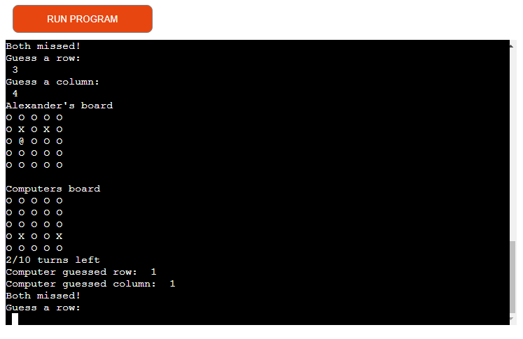
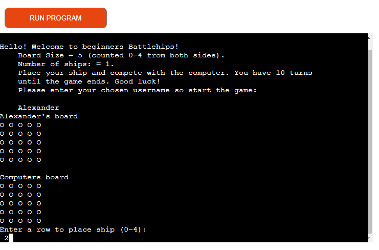
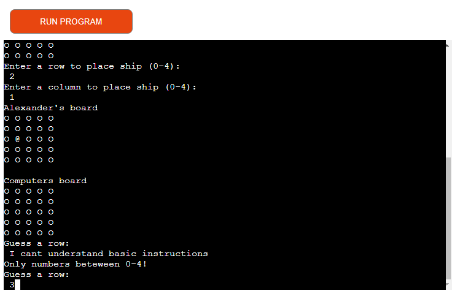

# Battleships game

Battleships is a Python terminal game, which runs in the 
Code Institute mock terminal on Heroku.

Users play against the computer and can try to beat it by finding
its hidden ship.

[Live version of the project](https://alexanders-battleships-game.herokuapp.com/)

## How to play

The player enters an optional username and two boards
are generated. The computers board has a randomly
generated (hidden) ship. 

The player is prompted to choose which row/column
to place their ship. The player can see their ship 
on the board, indicated by an @ symbol.

After placing their ship on the board, the player is prompted
to guess which row/column the computers ship is hidden.
The player can see their and the computers guesses,
indicated by an X symbol.

For each guess the computer also makes a random guess.

The game has a maximum of 10 turns until it ends
(unless victory/defeat).

 

## Features

- Board generation
  - Two boards are generated upon name input. 
  - The user can see their placed ship on their board.
- Play against the computers
- Maintains number of turns left
- Accept turns
- Input validation and error checking
  - You cannot enter coordinates outside the size
    of the grid
  - You must enter numbers

  

### Future Features 

- Allow the player to choose between easy, medium or hard difficulty levels. 
- Allow the player to place more ships on their board

# Testing

I have manually tested this project by doing the following: 

- Passed the code through a PEP8 linter and confirmed there are no problems.
- Given invalid inputs: string when numbers are expected, out of bounds inputs.
- Tested in my local terminal and the Code Institute Heroku terminal

## Bugs

### Solved Bugs

- The game would not replay upon end of game. I realised that I didn't indent the code properly which hindered the main() function from running.

- The number of turns left would not increment by 1 for each iteration in the play_game function. The reason for this bug was that the " turns += 1 " was misplaced in the code.

### Remaining Bugs
- No bugs Remaining

### Validator Testing

- PEP8
No errors were returned from PEP8online.com 

## Deployment

This project was deployed using Code Institute's mock terminal for Heroku.

- Steps for deployment:
Fork or clone this repository
Create a new Heroku app
Set the buildbacks to Python and NodeJS in that order
Link the Heroku app to the repository
Click on Deploy 

## Credits

 - Code Institute for the deployment terminal
 - Used this video to learn how to input ship placement "@" and player/computer guesses "X" on the board: [How to Code Battleship in Python - Single Player Game](https://www.youtube.com/watch?v=tF1WRCrd_HQ)
 - Used this video as a guideline on how to create the gameboards [Learn Python with CodeCademy: Battleship!](https://www.youtube.com/watch?v=7Ki_2gr0rsE&t=68)
 - [CS50's Introduction to Programming with Python](https://www.edx.org/course/cs50s-introduction-to-programming-with-python)
- [Code Institutes " Love Sandwiches Project "](https://learn.codeinstitute.net/courses/course-v1:CodeInstitute+LS101+2021_T1/courseware/293ee9d8ff3542d3b877137ed81b9a5b/58d3e90f9a2043908c62f31e51c15deb/)
